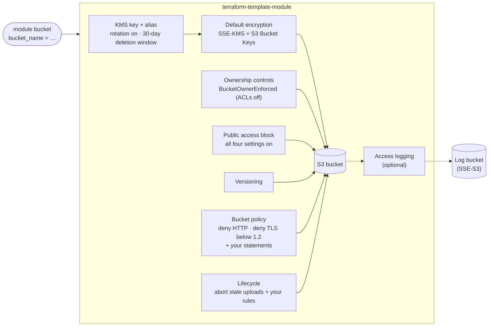

# terraform-template-module

[](https://github.com/codemarquis/terraform-template-module/actions/workflows/ci.yml)


[](LICENSE)

A template for production-grade Terraform modules. It ships with a working example module, a **secure-by-default S3 bucket**, plus the parts that usually get skipped: tests that run without cloud credentials, linting, security scanning, generated docs and tagged releases.

Use it two ways:

- **As a module.** Get an S3 bucket that passes a security review with one line of input.
- **As a template.** Click **Use this template**, replace the S3 resources with your own, and keep the tests, CI and release process.

---

## What the module creates



## Security controls

Each control is on by default. You opt out explicitly, and only where it makes sense.

| Control | Default | Why it matters |
|---|---|---|
| Encryption at rest | SSE-KMS with a dedicated customer-managed key, rotation enabled | Access to data needs both S3 and KMS permissions; key use is logged in CloudTrail |
| Bring your own key | `kms_key_arn` | Share one key across buckets or accounts |
| Encryption in transit | Policy denies `aws:SecureTransport = false` and `s3:TlsVersion < 1.2` | No plaintext or outdated TLS, even from inside the account |
| Public access | All four Block Public Access settings on, not configurable | A misconfigured policy or ACL can't make data public |
| ACLs | Disabled (`BucketOwnerEnforced`) | Access is decided by policy alone, so one place to audit |
| Versioning | Enabled | Overwrites and deletes can be undone |
| Incomplete multipart uploads | Aborted after 7 days | Invisible but billed storage is cleaned up |
| Accidental deletion | `force_destroy = false` | `terraform destroy` can't silently delete a bucket that holds data |
| Policy hardening | Your `additional_policy_json` is **appended**; the TLS baseline can't be removed | Callers can grant access but can't weaken transport security |
| Input validation | Bucket names, ARNs, storage classes, rule ids and day counts are checked at plan time | Mistakes fail fast with a clear message, before AWS is called |

## Usage

```hcl
module "assets" {
  source = "git::https://github.com/codemarquis/terraform-template-module.git?ref=v1.0.0"

  bucket_name = "acme-app-assets-prod"

  lifecycle_rules = [{
    id = "tier-down"
    transitions = [
      { days = 30, storage_class = "STANDARD_IA" },
      { days = 180, storage_class = "GLACIER_IR" },
    ]
    noncurrent_version_expiration_days = 90
  }]

  tags = { Project = "acme", Environment = "prod" }
}
```

Grant read/write access with IAM in the calling code, using the `bucket_arn` and `kms_key_arn` outputs. With SSE-KMS, principals also need `kms:Decrypt` and `kms:GenerateDataKey` on the key.

### Examples

| Example | Shows |
|---|---|
| [`examples/basic`](examples/basic) | The one-line call with every default |
| [`examples/complete`](examples/complete) | A data bucket with lifecycle tiering that sends access logs to a dedicated log bucket. Both are built with this module, and log delivery is scoped to the account and the source bucket |

## Using this as a template

1. Click **Use this template → Create a new repository**.
2. Replace `main.tf`, `variables.tf` and `outputs.tf` with your resources. Keep `versions.tf` and adjust the provider constraints.
3. Rewrite `tests/*.tftest.hcl` for your module. Every run uses a **mocked provider**, so tests are fast, free and need no credentials.
4. Update `examples/` and the hand-written parts of this README. The Inputs/Outputs section below is generated, so don't edit it by hand.
5. Push. CI checks formatting, validation, tests on the oldest and newest Terraform, tflint, Trivy, Checkov, and that the docs are current.
6. Release with a tag (`git tag -a v1.0.0 -m v1.0.0 && git push origin v1.0.0`). The release workflow publishes notes automatically.

### Repository layout

```
.
├── main.tf, variables.tf, outputs.tf, versions.tf   # the module
├── examples/
│   ├── basic/                                        # minimal usage
│   └── complete/                                     # every feature, composed
├── tests/                                            # terraform test, mocked AWS provider
│   ├── defaults.tftest.hcl                           # secure defaults
│   ├── encryption.tftest.hcl                         # BYO key / SSE-S3 fallback
│   ├── features.tftest.hcl                           # lifecycle, logging, policy merge
│   └── validation.tftest.hcl                         # bad input is rejected
├── .github/workflows/ci.yml                          # fmt, validate, test, tflint, Trivy, Checkov, docs
├── .github/workflows/release.yml                     # GitHub release on v*.*.* tags
├── .github/dependabot.yml                            # weekly action + provider updates
├── .pre-commit-config.yaml                           # the same checks before each commit
├── .tflint.hcl                                       # tflint with the AWS ruleset
└── .terraform-docs.yml                               # generates the Inputs/Outputs tables below
```

## Development

| Task | Command |
|---|---|
| Format | `terraform fmt -recursive` |
| Validate | `terraform init -backend=false && terraform validate` |
| Test | `terraform test` |
| Lint | `tflint --init && tflint --recursive` |
| Security scan | `trivy config .` and `checkov -d . --framework terraform` |
| Regenerate docs | `terraform-docs .` |
| All of the above on commit | `pre-commit install` |

The test suite has **20 runs**. They cover the secure defaults, both encryption fallbacks, lifecycle/logging/policy composition, and every input validation. The assertions were checked against weakened settings to confirm they fail. CI runs them on Terraform **1.7.5** (minimum supported) and the **latest** release.

Security-scanner exceptions are recorded inline with a reason (`#checkov:skip=…`), so every accepted risk is visible in code review.

## Versioning

Releases follow [Semantic Versioning](https://semver.org): breaking input/output changes bump the major version. Pin a tag in `source` (`?ref=v1.0.0`) rather than a branch. See [CHANGELOG.md](CHANGELOG.md).

---

<!-- BEGIN_TF_DOCS -->
## Requirements

| Name | Version |
|------|---------|
| terraform | >= 1.7 |
| aws | >= 5.0, < 7.0 |

## Providers

| Name | Version |
|------|---------|
| aws | >= 5.0, < 7.0 |

## Resources

| Name | Type |
|------|------|
| [aws_kms_alias.this](https://registry.terraform.io/providers/hashicorp/aws/latest/docs/resources/kms_alias) | resource |
| [aws_kms_key.this](https://registry.terraform.io/providers/hashicorp/aws/latest/docs/resources/kms_key) | resource |
| [aws_s3_bucket.this](https://registry.terraform.io/providers/hashicorp/aws/latest/docs/resources/s3_bucket) | resource |
| [aws_s3_bucket_lifecycle_configuration.this](https://registry.terraform.io/providers/hashicorp/aws/latest/docs/resources/s3_bucket_lifecycle_configuration) | resource |
| [aws_s3_bucket_logging.this](https://registry.terraform.io/providers/hashicorp/aws/latest/docs/resources/s3_bucket_logging) | resource |
| [aws_s3_bucket_ownership_controls.this](https://registry.terraform.io/providers/hashicorp/aws/latest/docs/resources/s3_bucket_ownership_controls) | resource |
| [aws_s3_bucket_policy.this](https://registry.terraform.io/providers/hashicorp/aws/latest/docs/resources/s3_bucket_policy) | resource |
| [aws_s3_bucket_public_access_block.this](https://registry.terraform.io/providers/hashicorp/aws/latest/docs/resources/s3_bucket_public_access_block) | resource |
| [aws_s3_bucket_server_side_encryption_configuration.this](https://registry.terraform.io/providers/hashicorp/aws/latest/docs/resources/s3_bucket_server_side_encryption_configuration) | resource |
| [aws_s3_bucket_versioning.this](https://registry.terraform.io/providers/hashicorp/aws/latest/docs/resources/s3_bucket_versioning) | resource |
| [aws_caller_identity.current](https://registry.terraform.io/providers/hashicorp/aws/latest/docs/data-sources/caller_identity) | data source |
| [aws_partition.current](https://registry.terraform.io/providers/hashicorp/aws/latest/docs/data-sources/partition) | data source |

## Inputs

| Name | Description | Type | Default | Required |
|------|-------------|------|---------|:--------:|
| bucket\_name | Globally unique bucket name (3-63 characters: lowercase letters, numbers, hyphens and dots). | `string` | n/a | yes |
| abort\_incomplete\_multipart\_upload\_days | Delete the parts of multipart uploads that never completed after this many days (they're billed but invisible). | `number` | `7` | no |
| access\_logging | Send server access logs to another bucket. That bucket must allow the logging.s3.amazonaws.com service principal and use SSE-S3. | ```object({ target_bucket = string target_prefix = optional(string) })``` | `null` | no |
| additional\_policy\_json | Extra bucket policy (for example from aws\_iam\_policy\_document). Its statements are appended to the module's TLS-only baseline, which can't be removed. | `string` | `null` | no |
| create\_kms\_key | Create a dedicated customer-managed KMS key (with rotation) when kms\_key\_arn is null. If false and no key is given, objects use SSE-S3 (AES-256) instead. | `bool` | `true` | no |
| force\_destroy | Allow `terraform destroy` to delete a bucket that still contains objects. Keep false for anything that matters. | `bool` | `false` | no |
| kms\_key\_arn | ARN of an existing KMS key for SSE-KMS. When null, the module creates a dedicated key (see create\_kms\_key). | `string` | `null` | no |
| kms\_key\_deletion\_window\_in\_days | Waiting period before a created KMS key is deleted. | `number` | `30` | no |
| lifecycle\_rules | Lifecycle rules. A rule that aborts incomplete multipart uploads after `abort_incomplete_multipart_upload_days` is always added. | ```list(object({ id = string enabled = optional(bool, true) prefix = optional(string, "") expiration_days = optional(number) noncurrent_version_expiration_days = optional(number) transitions = optional(list(object({ days = number storage_class = string })), []) }))``` | `[]` | no |
| tags | Tags for every resource the module creates. | `map(string)` | `{}` | no |
| versioning\_enabled | Keep every version of every object, so overwrites and deletes can be undone. | `bool` | `true` | no |

## Outputs

| Name | Description |
|------|-------------|
| bucket\_arn | Bucket ARN, for IAM policies. |
| bucket\_domain\_name | Bucket domain name (bucket.s3.amazonaws.com). |
| bucket\_id | Bucket name. |
| bucket\_regional\_domain\_name | Region-specific bucket domain name, for CloudFront origins. |
| encryption | Server-side encryption in use: "aws:kms" or "AES256". |
| kms\_key\_arn | ARN of the KMS key encrypting the bucket (created or supplied), or null for SSE-S3. Readers and writers need kms:Decrypt / kms:GenerateDataKey on it. |
<!-- END_TF_DOCS -->

## License

[MIT](LICENSE)
